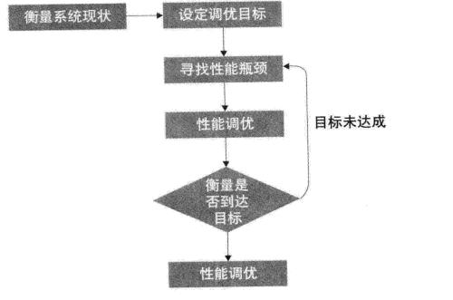

### 性能调优

#### 性能调优步骤

首先来看看性能调优需要的方法论指南：




依照上面的方法，当系统性能不满足需要的时候，首先需要找出来的是**性能瓶颈**。


##### 1.性能瓶颈

> 所谓性能瓶颈主要指的是资源消耗过大，这里的资源包括CPU，内存，网络等资源。

- cpu性能消耗分析

  先来了解如下几个概念：

  - cpu上下文切换消耗
  - 运行队列：指的是一个cpu核上等待运行的线程数
  - 利用率：cpu核的利用率，使用top可以看到cpu核的利用率，us代表用户进程，sy系统进程，ni表示nice命令改变优先级任务所占百分比，id表示cpu空闲所占的百分比，wa表示io等待所占百分比，hi表示硬件中断所占百分比，si表示软件中断所占百分比，进入top后按**1**，就会以每个核心来显示百分比

  对于Java应用，cpu消耗严重主要出现了**us,sy**中：

  ##### 1.us消耗过高

  > us消耗过高是因为线程一直处于**runnable**状态，通过命令找出一直处于活跃状态的进程。

  - Top命令找出消耗过高的Java线程
  - 使用kill -3 pid或者jstack **dump**出对应的线程堆栈

  > 这里有一个需要注意的地方，默认显示的是PID是JVM虚拟机进程ID，使用这个PID可以导出这个进程所有的线程堆栈。然后在TOP界面下，按**H**可以找出占用us最高的Java线程**PID**，然后把这个Pid转换为十六进制，然后在刚刚导出的线程堆栈里找即可

  ##### 2.sy消耗过高

  > 当sy消耗过高的时候，一般是线程上下文切换太过频繁导致的，可能的问题是线程数量不合理
  >
  > jstack -l pid 可以看到Jvm进程下线程的状况

  - 文件IO消耗分析

  > 使用**pidstat**命令。
  >
  > ```
  > pidstat -d -t -p 6354
  > //跟踪某个进程的io操作
  > ```

  ​	然后导出对应的线程即可。

  ​

  - 网络IO消耗分析

  > 没发现怎么找出具体的进程orz

  - 内存消耗分析
  - 程序执行慢的原因
    1. 锁竞争激烈
    2. 未充分利用硬件资源
    3. 数据量增大

##### 2.性能调优

> 找出了性能瓶颈后就可以针对性调优了。

