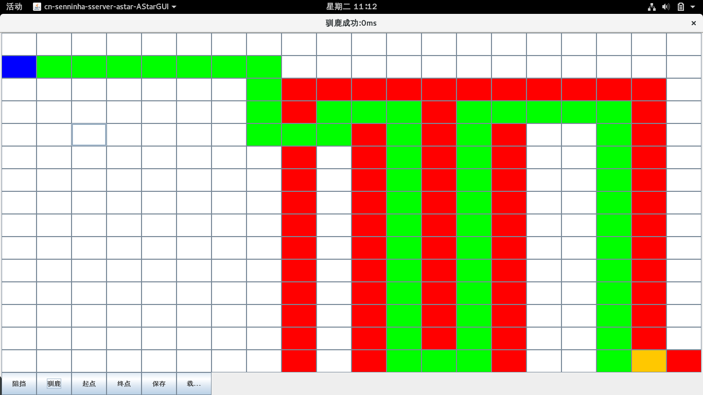

### A*搜寻算法

> **A\*搜索算法**，俗称**A星算法**。这是一种在图形平面上，有多个[节点](https://zh.wikipedia.org/wiki/%E7%AF%80%E9%BB%9E)的[路径](https://zh.wikipedia.org/wiki/%E8%B7%AF%E5%BE%84)，求出最低通过[成本](https://zh.wikipedia.org/wiki/%E6%88%90%E6%9C%AC)的[算法](https://zh.wikipedia.org/wiki/%E7%AE%97%E6%B3%95)。常用于游戏中的NPC的移动计算，或[在线游戏](https://zh.wikipedia.org/wiki/%E7%BD%91%E7%BB%9C%E6%B8%B8%E6%88%8F)的BOT的移动计算上。
>
> 该算法综合了Best-First Search和[Dijkstra算法](https://zh.wikipedia.org/wiki/Dijkstra%E7%AE%97%E6%B3%95)的优点：在进行启发式搜索提高算法效率的同时，可以保证找到一条最优路径（基于评估函数）。([维基百科](https://zh.wikipedia.org/wiki/A*%E6%90%9C%E5%AF%BB%E7%AE%97%E6%B3%95))
>
> 估算函数为：
>
> **f(n) = g(n) + h(n)**
>
> **f(n)**指的是整个寻路过程中的动态估值总长度
>
> **h(n)**指寻路过程**中途**某个节点到终点的距离
>
> **g(n)**指寻路过程中起点到当前结点的距离

- 整个算法的步骤如下：

 	 - 定义这几个数据结构，openList（可走的节点集合），closeList（已经被选过的节点集合)，节点有指向他的父节点的指针。

  	- 1.当前节点(就是一开始的出发点)，扫描周围的可走路径，所得的节点必须不在**closeList**中，然后计算出最小的f(n);	

  	- 2.找出当前最小的那个节点后，看一下是否存在在**openList**中	

	    - 如果不存在，直接把它加入**closeList**，其他的节点加入**openList**，并且设置他们的父节点为当前节点	

    	- 如果存在，将现在计算出来的g值与之前保存在**openList**里的g值比较，

      		- 若小，则表明现在的是更优路径，把选中节点设置为当前节点，并加入**closeList**

      		- 若大于或者等于，处理逻辑和不存在的情况一样

        以上这一步是为了找到离出发点更近的路，即动态搜寻更近的路径。

  	- 3.如果第二步找不到合适的节点，直接从openList里寻找f(n)值最小的，设置为cur，然后继续搜索。

 	- 直到closeList里包含了目的地，整个搜寻过程结束。
  
  	- 4.从目的地节点指向parent节点的引用反向遍历，即可找到一条路径

> 不用担心此路不通的情况，不通的话会通过**openList**绕回通的地方。加入**closeList**只是为了表示它已经被走过了，不再加入待考虑的列表中，并不代表加入**closeList**就是需要走的节点。

- 下面是Java实现，算法核心代码在这里[A*Java实现](https://github.com/iSenninha/tank/tree/v1.1/src/main/java/cn/senninha/game/map/util)，还做了一个丑。。的[Swing UI](https://github.com/iSenninha/tank/blob/v1.1/src/test/java/cn/senninha/sserver/astar/AStarGUI.java)，git clone下来，切到**v1.1**分支，跑**AStarGUI.java**，即可。。。

- 参考[A星](http://blog.csdn.net/hitwhylz/article/details/23089415)

~~~~