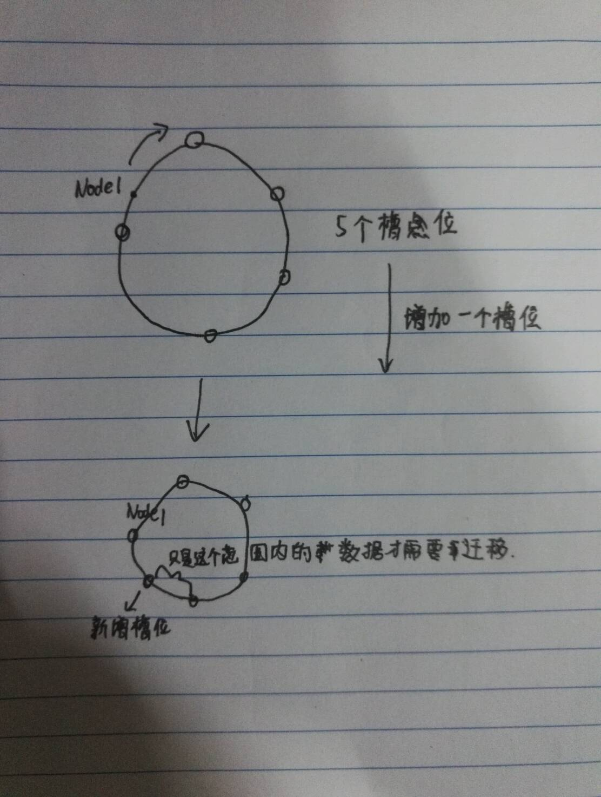

### 一致性哈希算法

> 传统的哈希算法在槽位**变化**的时候会导致严重大部分key都要**重新求余**导致大量节点数据都要迁移。所以衍生出了**一致性哈希**算法。

- 一致性哈希算法说明

> **传统哈希算法**的哈希计算**槽位点**是根据：哈希值 % 槽位数量，一旦槽位数量变化，全部槽位点基本都会发生**变化**。
>
> **一致性哈希算法**的**被求余数**不是**槽位数量**，而是固定为 **(2 ^ 32 - 1)**，并且抽象成一个圆环，每个数据该待的槽位是离它**顺时针最近**的那个槽位
>
> **被求余数**不再依赖槽位数量，所以在槽位扩展的时候不会导致大量的数据迁移

- 来个灵魂图来说明

  

​	

> 1.想象这个环上塞有 (2 ^ 32 - 1) 个点，一开始只有五个槽位，通过哈希均匀(假设均匀)分配到了圆环上的五个点，然后有Node1数据，哈希后求余到了介于九点到十二点方向节点之间，然后，他顺时针找到离他最近的槽位，很好，就是12点方向的那个。
>
> 2.然后，槽位需要扩展，在六点和九点方向新增了一个槽位，这个时候思考一下，在哪些槽位的数据才可能需要重新迁移？很好，只是在**九点**方向的那个槽位的数据可能要发生迁移。这样的话，平均只需要对 K / n 个数据进行迁移，K是关键字的数量，n是槽位数（Wiki:**一致哈希** 是一种特殊的[哈希](https://zh.wikipedia.org/wiki/%E5%93%88%E5%B8%8C)算法。在使用一致哈希算法后，哈希表槽位数（大小）的改变平均只需要对{\displaystyle K/n} 个关键字重新映射，其中 {\displaystyle K}是关键字的数量，{\displaystyle n}是槽位数量。然而在传统的[哈希表](https://zh.wikipedia.org/wiki/%E5%93%88%E5%B8%8C%E8%A1%A8)中，添加或删除一个槽位的几乎需要对所有关键字进行重新映射。）

- 哈希偏斜

> 槽位可能会分配得不均匀，这个时候可以用虚拟节点法来修正。
