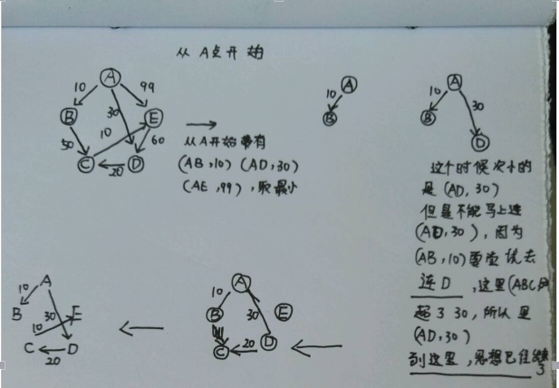

### 图

- 图的邻接矩阵表示

  如果一个图有**n**个结点，用**n*n**的矩阵来表示这个图的连接关系，如果这个图是无向图，那么这个矩阵必然是对称的，反之不然。

- 邻接表表示

  邻接矩阵的方式，当两个结点没有关系的时候，仍然使用一个储存空间去储存数据，造成了浪费，而**邻接表**的方式可以避免这个问题。

  - 顶点表

    顶点表表示的是这个邻接表的实际结点，可以用一个数组表示，这个数据结构包含两种数据：

    **节点的描述** --- **指向一个描述边关系的链表引用(即下面的边表)**

  - 边表

    边表描述边关系的数据结构，里面包含：

    **目标节点(即顶点表的位置描述)---权值---下一个边表节点**

    图如下：

    

    ​

- 广度优先搜索和深度优先搜索

  图的广度优先搜索和深度优先搜索

- 最小生成树

  > **树**是**无连通**的**无向图**，按这个思路，一个有联通的无向图，去掉一些边，即可生成一个**树**。

  - 最小生成树

    > 一个带权值的图生成一个权值最小的树，即是最小生成树。

  - Prim算法(普里姆算法)

    > 从**一个节点**开始，寻找最小的权值的节点，然后从**被寻找的节点**开始，继续寻找权值最小的节点。
    >
    > 时间复杂度是0(n^2)，与边的条数无关，适合用于边比较多的情况下。

  - Kruskal算法(克鲁斯卡尔算法)

    > 与Prim算法类似，思想是一致的，只是这里生成的过程是逐个从**所有的边上寻找一条最小权的且不会构成连通图的边进行连接**。
    >
    > 实现的过程中：
    >
    > 1. 要对所有的边权值进行排序
    > 2. 要有一个算法判断是否形成了连通图

- 最短路径

  > 最短路径是指一个连通图，A-D点可能有多种路径，求最短路径的长度

  - Dijkstra算法(迪杰斯科拉算法)

    > Dijkstar算法是已知一个连通图，给定一个顶点，求这个顶点到其他所有的节点的最小值

    ​	看图解析：

    ​	

​			整个过程的：

| AB   | AD   | ADC  | ADCE |
| ---- | ---- | ---- | ---- |
| 10   | 30   | 50   | 60   |

​			算法思想：

> 其实算法思想就是，从源头**A**开始，排序所有的最短路径:
>
> ​	(AB,10) (AD,30),(AE,99)
>
> 选最短路径那个，连接(这里第一个是**AB**)，然后把**AB**视为同一个节点，从B出发，这个时候由：
>
> ​	(ABC,60) (AD,30),(AE,99)
>
> 选AD，AD又是一个节点：
>
> ​	(ABC,60)(ADC,50),(AE,99)
>
> 这个时候选(ADC,50)，并且淘汰(ABC,60),然后**ADC**视为一个节点:
>
> ​	(ADCE,50),(AE,99)
>
> 显然，淘汰AE，**ADCE**，再也没有其他节点了，结果也全部出来了
>
> 然后就会发现，**加重**的组合就是上面**表格**里的顺序。

