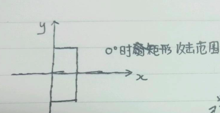
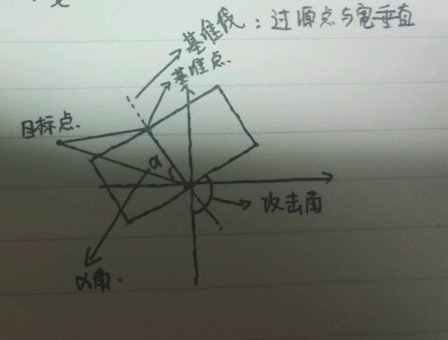

### 矩形攻击范围判定

> 游戏中，某个技能的作用范围可能是矩形，而矩形范围相对于扇形或者是圆形更复杂一点。
>
> 给定**源点坐标(技能释放者)**，**矩形的长和宽**，**攻击角度(相对于直角坐标系的0度)**，**目标点坐标**，判断目标点是否处于矩形范围内。

- 首先定义0度角和矩形范围：

  


​	如果长宽总与坐标系垂直平行，这个判定就非常简单，但是，我们是有攻击角度的，意味着更多的情况是这样：

​			

​	

- 一般情况的矩形攻击计算步骤

  先定义基准点，基准线概念，基准线即源点发出的与宽**垂直**的一条线，基准点是基准线与**上宽**的交点。

  - 1.计算**基准点**坐标;

  - 2.计算角度**a**，利用余弦定理，**目标点坐标**，**坐标源点**，**基准点**构成一个三角型，计算**目标点-基准点**对应的边的角度**a**

    根据角度a是否小于90度，可判断目标是否在攻击方向上，如果不在，直接返回false;

  - 3.根据角度**a**，根据正余弦函数，计算对应在攻击角度上增加的距离，与宽度的1/2和长度相比是否满足。


- 需要注意的问题：
  1. 进行反余弦计算的时候，要注意，如果值>1的时候，会返回NaN，由于浮点数的不精确的原因，应该对输入作一次修正;
  2. 同样是由于浮点数不精确的原因，需要对边界作修正，其实不修正也没事。。但是第一点必须修正。


下面附上完整代码：

```
public class RectDetect {

	public static void main(String[] args) {
		boolean flag = inRect(0, 0, 1, 1, 4, 4, 45);
		System.out.println(flag);
	}

	/**
	 * 计算该点是否在远点范围内
	 * 
	 * @param sourceX
	 *            源x坐标
	 * @param sourceY
	 * @param targetX
	 *            目标x坐标
	 * @param targetY
	 * @param width
	 *            矩形宽度
	 * @param height
	 * @parma angle 角度,0-360度
	 * @return 是否在矩形范围内
	 */
	public static boolean inRect(double sourceX, double sourceY, double targetX,
			double targetY, double width, double height, double angle) {
		if (angle < 0 || angle > 360) {
			throw new IllegalArgumentException("范围在0～360度");
		}
		double[] standardXY = getStandard(sourceX, sourceY, height, angle);
		double standradToTarget = caculateTwoPointDistance(standardXY[0],
				standardXY[1], targetX, targetY); // 源点到基准点距离
		double sourceToTarget = caculateTwoPointDistance(sourceX, sourceY,
				targetX, targetY); // 源点到目标的距离
		double redians = caculateRedians(standradToTarget, sourceToTarget,
				height);
		if (redians < (Math.PI / 2)) { // 保证攻击点在攻击方向上
			double widthReal = Math.sin(redians) * sourceToTarget; // 目标点到基准线的距离
			double heightReal = Math.cos(redians) * sourceToTarget; // 目标点投影到基准线上距离源点的距离
			if ((widthReal <= (width / 2)) && heightReal <= height) {
				return true;
			}
		}
		return false;
	}

	/**
	 * 返回基准点的坐标[x][y]
	 * 
	 * @param sourceX
	 *            源x坐标
	 * @param sourceY
	 * @param height
	 *            矩形高度
	 * @param angle
	 *            角度
	 * @return 基准点 [x][y]
	 */
	private static double[] getStandard(double sourceX, double sourceY,
			double height, double angle) {
		double angleTem = angle;
		angleTem = (Math.PI / 2) - angleTem / 180 * Math.PI; // 转化成弧度
		double x = Math.sin(angleTem) * height;
		double y = Math.cos(angleTem) * height;
		sourceX = sourceX + x;
		sourceY = sourceY + y;
		return new double[]{sourceX, sourceY};
	}

	/**
	 * 计算两点间的距离
	 * 
	 * @param x0
	 * @param y0
	 * @param x1
	 * @param y1
	 * @return 返回两点间的距离
	 */
	private static double caculateTwoPointDistance(double x0, double y0,
			double x1, double y1) {
		double tem = Math.pow(x0 - x1, 2) + Math.pow(y0 - y1, 2);
		tem = Math.sqrt(tem);
		return tem;
	}

	/**
	 * 根据余弦定理给出了角A的弧度
	 * 
	 * @param a
	 *            A长度
	 * @param b
	 *            B长度
	 * @param c
	 *            C长度
	 * @return 返回角A弧度
	 */
	private static double caculateRedians(double a, double b, double c) {
		double cosA = (Math.pow(b, 2) + Math.pow(c, 2) - Math.pow(a, 2))
				/ (2 * b * c);
		if (cosA < -1) { // 校验，防止出现NaN的结果
			cosA = -1;
		}
		if (cosA > 1) {
			cosA = 1;
		}
		double angle = Math.acos(cosA);
		return angle;
	}

}

```

