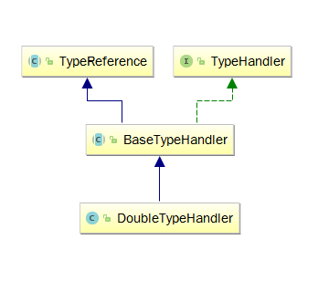

###Mybatis的类型处理器TypeHandler
> Mybatis的类型处理器，类似于**编解码**处理器，为什么说是编解码呢？
**DB-->Java**理解成解码，那么**Java-->DB**不就是编码了吗。从这个角度来说，更容易理解。

<br>
<br>

####类图


- TypeHandler里有如下接口：
```
  void setParameter(PreparedStatement ps, int i, T parameter, JdbcType jdbcType) throws SQLException;

  T getResult(ResultSet rs, String columnName) throws SQLException;

  T getResult(ResultSet rs, int columnIndex) throws SQLException;

  T getResult(CallableStatement cs, int columnIndex) throws SQLException;
```
**setParameter**其实就是**编码接口**，把**Java--->DB**，
其余三个**getXXX**就是**解码接口**了，把**DB-->Java**。

- TypeReference
类似一个工具类，通过递归追溯**父类**的方式来找到那个对应的类型，比如泛型指定**String**，通过这个工具类去获取**String**。
简化版代码如下:
```
    Type rawType = ((ParameterizedType) genericSuperclass).getActualTypeArguments()[0];
```
比如**ShortTypeHandler**,类名是这样的:
```
public class ShortTypeHandler extends BaseTypeHandler<Short> 
```
BaseTypeHandler是继承了TypeReference的，所以上面那段代码将获取到**Short**这个类型。

####例子
继承**BaseTypeHandler**即可简单实现一个处理器:
```
public class SenninhaTypeHandler extends BaseTypeHandler<String>{
    private static org.slf4j.Logger logger = LoggerFactory.getLogger(SenninhaTypeHandler.class);
    private Object obj = new Object();	//这里是为了验证是否使用同一个类处理器对象
    @Override
    public void setNonNullParameter(PreparedStatement ps, int i, String parameter, JdbcType jdbcType) throws SQLException {
       logger.info("senninha set parameter:{},index:{},toString:{}", parameter, i, this.toString());
       ps.setString(i, parameter);
    }

    @Override
    public String getNullableResult(ResultSet rs, String columnName) throws SQLException {
        logger.info("senninha get result:{}, toString:{}", columnName, this.toString());
        return rs.getString(columnName);
    }

    @Override
    public String getNullableResult(ResultSet rs, int columnIndex) throws SQLException {
        logger.info("senninha get columnIndex:{},toString:{}", columnIndex, this.toString());
        return rs.getString(columnIndex);
    }

    @Override
    public String toString() {
        return obj.toString();
    }

    @Override
    public String getNullableResult(CallableStatement cs, int columnIndex) throws SQLException {
        return cs.getString(columnIndex);
    }
}
```
其实这就是一个**StringTypeHandler**

配置文件:
```
    <resultMap type="cn.senninha.db.entity.Test" id="testMap">
        <id column="id" property="id" jdbcType="INTEGER" />
        <result column="name" property="name" typeHandler="cn.senninha.db.type.SenninhaTypeHandler"/>
    </resultMap>
```
配置文件里指定了用我们自己定义的**SenninhaTypeHandler**去处理(编解码)处理
