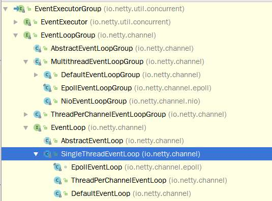

### EventLoopInNetty
> 这里主要记录netty的EventLoop类库的结构体系

#### 1.结构



- EventExecutorGroup

  继承了JDK的**ScheduledService**，加入了自己的**shutdownGracefully**和重要的**next()**方法返回组内的下一个执行器**EventExecutor**

- EventExecutor & EventLoopGroup
  这两个接口，**EventExecutor**新增了**inEventLoop()**方法返回当前的线程是否处于事件loop中，用于并发新增的任务处理。
  **EventLoopGroup**主要新增了**register(Channel channle)**方法，这个方法是用于将**channel**注册进这个**EventLoop**里面去的，整个继承先上**第一个与通信**相关的接口

- EventLoop接口
  然后**EventLoop**接口又继承了**EventExecutror**与**EventLoopGroup**接口，作为处理所有channel的**I/O**操作的统一接口。
  ```
  /**
   * Will handle all the I/O operations for a {@link Channel} once registered.
   *
   * One {@link EventLoop} instance will usually handle more than one {@link Channel} but this may depend on
   * implementation details and internals.
   *
   */
  public interface EventLoop extends OrderedEventExecutor, EventLoopGroup {
      @Override
      EventLoopGroup parent();
  }
  ```

- SingleThreadEventLoop.java

  这里继承了**SingleThreadEventExecutor**（实现了任务处理），并实现了**register(Channel channel)**。

  ```
      @Override
      public ChannelFuture register(Channel channel) {
          return register(new DefaultChannelPromise(channel, this));
      }

      @Override
      public ChannelFuture register(final ChannelPromise promise) {
          ObjectUtil.checkNotNull(promise, "promise");
          promise.channel().unsafe().register(this, promise);
          return promise;
      }
  ```

- NioEventLoop

  我们用Netty，通常是使用**Nio**模式来通信，整个**Nio**的读写操作以及任务队列的执行的策略都在**NioEventLoop**里实现，而其他的核心是**run**方法，这里不贴代码了。

- MultithreadEventExecutorGroup & NioEventLoopGroup

  上面那些都是单个线程的**EventLoop**，这里将上面的整合起来，前者留出**newChild(ThreadFactory factory, Object... args)**实现多线程的接口。后者实现了这个接口的逻辑:

  ```
  @Override
      protected EventLoop newChild(Executor executor, Object... args) throws Exception {
          return new NioEventLoop(this, executor, (SelectorProvider) args[0],
              ((SelectStrategyFactory) args[1]).newSelectStrategy(), (RejectedExecutionHandler) args[2]);
      }
  ```

  与**NioEventLoop**整合起来了。
#### 2.NioEventLoop实现

##### 2.1.使用SelectedSelectionKeySet替换默认的Selector里的HashSet

使用**SelectedSelectionKeySet**替换默认**Selector**实现里的**HashSet**，前者是一个数组实现的**fake Set**，仅仅是为了与接口兼容。使用两个等容量的数组来优化直接使用HashSet来加速迭代减少GC压力，然后select的时候，就绪的selectedKeys就会添加到这里来。具体的[提交记录](https://github.com/netty/netty/commit/3ce9ab2e72235bf2ae45f57de11803249419cb69)和优化讨论在[Discuss SelectedSelectionKeySet optimization in NioEventLoo #6105](https://github.com/netty/netty/issues/6105)

##### 2.2.select与任务

**NioEventLoop**的**run**方法实现了对应的I/O select和任务的处理:

```
 @Override
    protected void run() {
        for (;;) {
            try {
                try {
                // 1.优化wakeup的时机
                    switch (selectStrategy.calculateStrategy(selectNowSupplier, hasTasks())) {
                    case SelectStrategy.CONTINUE:
                        continue;
                    case SelectStrategy.BUSY_WAIT:
                    case SelectStrategy.SELECT:
                        select(wakenUp.getAndSet(false));

                        if (wakenUp.get()) {
                            selector.wakeup();
                        }
                        // fall through
                    default:
                    }
                } catch (IOException e) {
                    rebuildSelector0();	// 2.处理空轮询的问题，重建selector
                    handleLoopException(e);
                    continue;
                }

                cancelledKeys = 0;
                needsToSelectAgain = false;
                final int ioRatio = this.ioRatio;
                if (ioRatio == 100) {	// 3.I/O比例在整个线程的工作时间内的比例
                    try {
                        processSelectedKeys(); // 4.处理就绪的selectedKey
                    } finally {
                        // Ensure we always run tasks.
                        runAllTasks();
                    }
                } else {
                    final long ioStartTime = System.nanoTime();
                    try {
                        processSelectedKeys();
                    } finally {
                        // Ensure we always run tasks.
                        final long ioTime = System.nanoTime() - ioStartTime;
                        runAllTasks(ioTime * (100 - ioRatio) / ioRatio);
                    }
                }
            } catch (Throwable t) {
                handleLoopException(t);
            }
            // Always handle shutdown even if the loop processing threw an exception.
            try {
                if (isShuttingDown()) {
                    closeAll();
                    if (confirmShutdown()) {
                        return;
                    }
                }
            } catch (Throwable t) {
                handleLoopException(t);
            }
        }
    }
```

- 1-3直接在队列代码里注释了。


- 4.这里处理就绪的**selectedKeys**，代码如下:

  ```
      private void processSelectedKeys() {
          if (selectedKeys != null) {
              processSelectedKeysOptimized();
          } else {
              processSelectedKeysPlain(selector.selectedKeys());
          }
      }
  ```

  如果这个**selectedKeys**不为空，那么说明是走的是优化版的**set**(见2.1)，就绪的keys直接会在**select**的时候添加进这里来。否则，按正常的nio进行迭代就绪keys。

  着重看优化后的:

  ```
   private void processSelectedKeysOptimized() {
          for (int i = 0; i < selectedKeys.size; ++i) {
              final SelectionKey k = selectedKeys.keys[i];
              selectedKeys.keys[i] = null;

              final Object a = k.attachment();

              if (a instanceof AbstractNioChannel) {
                  processSelectedKey(k, (AbstractNioChannel) a);
              } else {
                  @SuppressWarnings("unchecked")
                  NioTask<SelectableChannel> task = (NioTask<SelectableChannel>) a;
                  processSelectedKey(k, task);
              }

              if (needsToSelectAgain) {
                  selectedKeys.reset(i + 1);
                  selectAgain();
                  i = -1;
              }
          }
      }
  ```

##### 2.3.accept bossThread-->workThread

- 上面直接讲到了**select**和处理就绪**keys**的过程。netty的示例demo是这样的:

  ```
   public void run() throws Exception {
          EventLoopGroup bossGroup = new NioEventLoopGroup(); // (1)
          EventLoopGroup workerGroup = new NioEventLoopGroup();
          try {
              ServerBootstrap b = new ServerBootstrap(); // (2)
              b.group(bossGroup, workerGroup)
               .channel(NioServerSocketChannel.class) // (3)
               .childHandler(new ChannelInitializer<SocketChannel>() { // (4)
                   @Override
                   public void initChannel(SocketChannel ch) throws Exception {
                       ch.pipeline().addLast(new DiscardServerHandler());
                   }
               })
               .option(ChannelOption.SO_BACKLOG, 128)          // (5)
               .childOption(ChannelOption.SO_KEEPALIVE, true); // (6)
      
              // Bind and start to accept incoming connections.
              ChannelFuture f = b.bind(port).sync(); // (7)
      
              // Wait until the server socket is closed.
              // In this example, this does not happen, but you can do that to gracefully
              // shut down your server.
              f.channel().closeFuture().sync();
          } finally {
              workerGroup.shutdownGracefully();
              bossGroup.shutdownGracefully();
          }
      }
  ```

  如上，是分两个**EventLoopGroup**的，一个**Boss**是用来accept连接的，另外一个**Work**是来连接完成后处理其他正常通信的。一个请求连接后是如何从**Boss**转给**Work**的EventLoop呢？

- ServerBootstrap  ServerBootstrapAcceptor

  ServerBootstrap 初始化的时候，会添加如下Handler:

  ```
    p.addLast(new ChannelInitializer<Channel>() {
              @Override
              public void initChannel(final Channel ch) throws Exception {
                  final ChannelPipeline pipeline = ch.pipeline();
                  ChannelHandler handler = config.handler();
                  if (handler != null) {
                      pipeline.addLast(handler);
                  }

                  ch.eventLoop().execute(new Runnable() {
                      @Override
                      public void run() {
                          pipeline.addLast(new ServerBootstrapAcceptor(
                                  ch, currentChildGroup, currentChildHandler, currentChildOptions, currentChildAttrs));
                      }
                  });
              }
          });
  ```

  **ServerBootstrapAcceptor**是**ServerBootstrap**的内部类，它的**channelRead**方法如下:

  ```
    public void channelRead(ChannelHandlerContext ctx, Object msg) {
              final Channel child = (Channel) msg;

              child.pipeline().addLast(childHandler);

              setChannelOptions(child, childOptions, logger);

              for (Entry<AttributeKey<?>, Object> e: childAttrs) {
                  child.attr((AttributeKey<Object>) e.getKey()).set(e.getValue());
              }

              try {
              // 调用work eventloop线程组注册accept完毕后的连接
                  childGroup.register(child).addListener(new ChannelFutureListener() {
                      @Override
                      public void operationComplete(ChannelFuture future) throws Exception {
                          if (!future.isSuccess()) {
                              forceClose(child, future.cause());
                          }
                      }
                  });
              } catch (Throwable t) {
                  forceClose(child, t);
              }
          }
  ```

  如上，连接**Accept**完毕后，就注册到**childGroup**(即work)里去进行接下去的读写操作。

##### 2.4.分发给多个线程
一般来说，**childGroup**是多线程的，注册前需要分发找到对应的处理线程:
MultiThreadEventLoopGroup#register()，最后的分发是跑到**EventExecutorChooser**这个接口里。
这个接口有两种实现，共同点都是通过一个递增的**AtomicInteger**，不同的是分发算法，一种是线程数量是**powerOf2**的时候，直接用**&**运算，另外一种是一般的情况，用**求余**运算。用**&**的方式可以加快计算速度。
另外，判断是否是**powerOf2**的算法有点意思:
```
boolean isPowerOf2(int num){
    return (num & -num) == num;
}
```
与上自己的相反数，是否等于自身。举个栗子:
```
// 2
0000 0010
//相反数
1111 1110
// 与
0000 0010
```

#### 3. ChannelHandlerContext,ChannelHandler和ChannelPipeline
如上分析了一个连接建立后，分发到对应的线程，然后通过**ChannelHandler**链式处理。

##### 3.1. ChannelHandlerContext与ChannelHandler的关系
直接看ChannelHandlerContext上的JDoc，可以看到描述:
> Enables a ChannelHandler to interact with its ChannelPipeline and other Handlers。

ChannelHandlerContext的实现主要是三个：
- HeadCoontext 对应HeadHandler
- TailContext 对应TailHandler
- DefaultChannelHandlerContext 对应用户自定义的Handler

回过头来看一开始的服务Demo:
```
                   public void initChannel(SocketChannel ch) throws Exception {
                       ch.pipeline().addLast(new DiscardServerHandler());
                   }
```

可以看到，直接通过**ChannelPipeline**增加对应的**Handler**,下面是DefaultChannelPipeline的实现:
```
    @Override
    public final ChannelPipeline addLast(EventExecutorGroup group, String name, ChannelHandler handler) {
        final AbstractChannelHandlerContext newCtx;
        synchronized (this) {
            checkMultiplicity(handler);

            // 将Handler用ChannelHandlerContext封装
            newCtx = newContext(group, filterName(name, handler), handler);

            addLast0(newCtx);

            // If the registered is false it means that the channel was not registered on an eventloop yet.
            // In this case we add the context to the pipeline and add a task that will call
            // ChannelHandler.handlerAdded(...) once the channel is registered.
            if (!registered) {
                newCtx.setAddPending();
                callHandlerCallbackLater(newCtx, true);
                return this;
            }

            EventExecutor executor = newCtx.executor();
            if (!executor.inEventLoop()) {
                newCtx.setAddPending();
                executor.execute(new Runnable() {
                    @Override
                    public void run() {
                        callHandlerAdded0(newCtx);
                    }
                });
                return this;
            }
        }
        callHandlerAdded0(newCtx);
        return this;
    }
```
将Handler用**ChannelHandlerContext**封装起来，这个添加的过程是一个加锁的过程。

##### 3.2 ChannelHanderl的链式调用
举个read事件的链式传递。
AbstractChannelHandlerContext#fireChannelRead():
```
    @Override
    public ChannelHandlerContext fireChannelRead(final Object msg) {
        invokeChannelRead(findContextInbound(), msg);
        return this;
    }
   
```
筛选出**Inbound**的Handler，避免调用栈过深:
```
   private AbstractChannelHandlerContext findContextInbound() {
       AbstractChannelHandlerContext ctx = this;
       do {
           ctx = ctx.next;
       } while (!ctx.inbound);
       return ctx;
   }
```

筛选出下一个**ChannelHandlerContext**后，执行:

```
    static void invokeChannelRead(final AbstractChannelHandlerContext next, Object msg) {
        final Object m = next.pipeline.touch(ObjectUtil.checkNotNull(msg, "msg"), next);
        EventExecutor executor = next.executor();
        if (executor.inEventLoop()) {
            next.invokeChannelRead(m);
        } else {
            executor.execute(new Runnable() {
                @Override
                public void run() {
                    next.invokeChannelRead(m);
                }
            });
        }
    }

    // 链式执行下一个Handler
    private void invokeChannelRead(Object msg) {
        if (invokeHandler()) {
            try {
                ((ChannelInboundHandler) handler()).channelRead(this, msg);
            } catch (Throwable t) {
                notifyHandlerException(t);
            }
        } else {
            fireChannelRead(msg);
        }
    }
```
以此类推，其他的**channelActive**之类的链式调用也是这个原理

#### 4.Read & Write
##### 4.1 OP_READ,OP_CONNECT 事件注册
[Netty注册事件](https://segmentfault.com/q/1010000016888465/a-1020000017163103)

注册interestOps有两种方式：
1.一是**register**的时候带上参数;
2.另外一种是**SelectionKey#interestOps**

netty使用的是后者，具体的代码在 **AbstractNioChannel#doBeginRead**
```
    @Override
    protected void doBeginRead() throws Exception {
        // Channel.read() or ChannelHandlerContext.read() was called
        final SelectionKey selectionKey = this.selectionKey;
        if (!selectionKey.isValid()) {
            return;
        }

        readPending = true;

        final int interestOps = selectionKey.interestOps();
        if ((interestOps & readInterestOp) == 0) {
            selectionKey.interestOps(interestOps | readInterestOp);
        }
    }
```
对于你描述的场景，其实是**NioServerSocketChannel**,上面的函数会在**bind**的时候调用，方法中使用的成员变量**interestOps**的值会在构造的时候传入:
```    
    /**
     * Create a new instance using the given {@link ServerSocketChannel}.
     */
    public NioServerSocketChannel(ServerSocketChannel channel) {
        super(null, channel, SelectionKey.OP_ACCEPT);
        config = new NioServerSocketChannelConfig(this, javaChannel().socket());
    }

```
所以，注册的其实是**OPS_ACCEPT**，即**16**。
对于普通的**Channel**也同样是走以上的方式注册。

##### 4.2.Read
前面**NioEventLoop**已经说到了**Select**的操作,select返回后，从就绪的SelectionKeys里执行对应的读,读取后继续走**ChannelHandler**链:
```
{
        final AbstractNioChannel.NioUnsafe unsafe = ch.unsafe();
        if (!k.isValid()) {
            final EventLoop eventLoop;
            try {
                eventLoop = ch.eventLoop();
            } catch (Throwable ignored) {
                // If the channel implementation throws an exception because there is no event loop, we ignore this
                // because we are only trying to determine if ch is registered to this event loop and thus has authority
                // to close ch.
                return;
            }
            // Only close ch if ch is still registerd to this EventLoop. ch could have deregistered from the event loop
            // and thus the SelectionKey could be cancelled as part of the deregistration process, but the channel is
            // still healthy and should not be closed.
            // See https://github.com/netty/netty/issues/5125
            if (eventLoop != this || eventLoop == null) {
                return;
            }
            // close the channel if the key is not valid anymore
            unsafe.close(unsafe.voidPromise());
            return;
        }

        try {
            int readyOps = k.readyOps();
            // We first need to call finishConnect() before try to trigger a read(...) or write(...) as otherwise
            // the NIO JDK channel implementation may throw a NotYetConnectedException.
            if ((readyOps & SelectionKey.OP_CONNECT) != 0) {
                // remove OP_CONNECT as otherwise Selector.select(..) will always return without blocking
                // See https://github.com/netty/netty/issues/924
                int ops = k.interestOps();
                ops &= ~SelectionKey.OP_CONNECT;
                k.interestOps(ops);

                unsafe.finishConnect();
            }

            // Process OP_WRITE first as we may be able to write some queued buffers and so free memory.
            if ((readyOps & SelectionKey.OP_WRITE) != 0) {
                // Call forceFlush which will also take care of clear the OP_WRITE once there is nothing left to write
                ch.unsafe().forceFlush();
            }

            // Also check for readOps of 0 to workaround possible JDK bug which may otherwise lead
            // to a spin loop
            if ((readyOps & (SelectionKey.OP_READ | SelectionKey.OP_ACCEPT)) != 0 || readyOps == 0) {
                unsafe.read();
            }
        } catch (CancelledKeyException ignored) {
            unsafe.close(unsafe.voidPromise());
        }
    }
```

##### 4.3.Write
先捋一下写操作的流程图:
> ChannelHanlerCtx#write(obj) -> 链式调用ChannelHandler(这其中包括编码)
    -> HeadContext -> Channel#write() -> ChannelOutputBuffer(缓存到这里)
    -> 调用flush的时候才可能真正写入到网络I/O
    
前面的流程很容易懂，最后真正写入的策略(flush)贴一下代码,**AbstractChannel#flush**:
```
        @Override
        public final void flush() {
            assertEventLoop();

            ChannelOutboundBuffer outboundBuffer = this.outboundBuffer;
            if (outboundBuffer == null) {
                return;
            }

            outboundBuffer.addFlush();
            flush0();
        }
```    
真正的操作在**fulsh0的doWrite**里,这个方法是在**NioSocketChannel#doWrite**实现的:
```
    @Override
    protected void doWrite(ChannelOutboundBuffer in) throws Exception {
        for (;;) {
            int size = in.size();
            if (size == 0) {
                // All written so clear OP_WRITE    关闭事件
                clearOpWrite();
                break;
            }
            long writtenBytes = 0;
            boolean done = false;
            boolean setOpWrite = false;

            // Ensure the pending writes are made of ByteBufs only.
            ByteBuffer[] nioBuffers = in.nioBuffers();
            int nioBufferCnt = in.nioBufferCount();
            long expectedWrittenBytes = in.nioBufferSize();
            SocketChannel ch = javaChannel();

            // Always us nioBuffers() to workaround data-corruption.
            // See https://github.com/netty/netty/issues/2761
            switch (nioBufferCnt) {
                case 0:
                    // We have something else beside ByteBuffers to write so fallback to normal writes.
                    // 这里走类似FileRegion这样的0拷贝传输
                    super.doWrite(in);
                    return;
                case 1:
                    // Only one ByteBuf so use non-gathering write
                    // 单个ByteBuffer的话，不走聚集写，优化性能
                    ByteBuffer nioBuffer = nioBuffers[0];
                    for (int i = config().getWriteSpinCount() - 1; i >= 0; i --) {
                        final int localWrittenBytes = ch.write(nioBuffer);
                        if (localWrittenBytes == 0) {
                            setOpWrite = true;
                            break;
                        }
                        expectedWrittenBytes -= localWrittenBytes;
                        writtenBytes += localWrittenBytes;
                        if (expectedWrittenBytes == 0) {
                            done = true;
                            break;
                        }
                    }
                    break;
                default:
                    for (int i = config().getWriteSpinCount() - 1; i >= 0; i --) {
                        // 标记1,真正执行网络I/O
                        final long localWrittenBytes = ch.write(nioBuffers, 0, nioBufferCnt);
                        if (localWrittenBytes == 0) {
                            setOpWrite = true;
                            break;
                        }
                        expectedWrittenBytes -= localWrittenBytes;
                        writtenBytes += localWrittenBytes;
                        if (expectedWrittenBytes == 0) {
                            done = true;
                            break;
                        }
                    }
                    break;
            }

            // Release the fully written buffers, and update the indexes of the partially written buffer.
            // 标记2
            in.removeBytes(writtenBytes);

            if (!done) {
                // Did not write all buffers completely.
                incompleteWrite(setOpWrite);
                break;
            }
        }
    }
```
- 1.标记1
    这里是真正执行网络I/O操作的地方，这个方法一般是不会阻塞的(除非其他线程同时调用了这个方法)，也就是说，如果我想写100个Bytes，但是此时底层只准备好写50个字节，那么会返回写入了50。
    如果返回0的话，说明底层已经不能再写了，这个时候，直接break，并且会尝试注册**OP_WRITE**，那么随后在**NioEventLoop#processSelectedKey**的时候再去刷新:
    ```
               try {
                   int readyOps = k.readyOps();
                   // We first need to call finishConnect() before try to trigger a read(...) or write(...) as otherwise
                   // the NIO JDK channel implementation may throw a NotYetConnectedException.
                   if ((readyOps & SelectionKey.OP_CONNECT) != 0) {
                       // remove OP_CONNECT as otherwise Selector.select(..) will always return without blocking
                       // See https://github.com/netty/netty/issues/924
                       int ops = k.interestOps();
                       ops &= ~SelectionKey.OP_CONNECT;
                       k.interestOps(ops);
       
                       unsafe.finishConnect();
                   }
       
                   // Process OP_WRITE first as we may be able to write some queued buffers and so free memory.
                   if ((readyOps & SelectionKey.OP_WRITE) != 0) {
                        // 刷新，并且如果不需要写的话，还会关闭写事件,这个关闭事件是在
                       // Call forceFlush which will also take care of clear the OP_WRITE once there is nothing left to write
                       ch.unsafe().forceFlush();
                   }
       
                   // Also check for readOps of 0 to workaround possible JDK bug which may otherwise lead
                   // to a spin loop
                   if ((readyOps & (SelectionKey.OP_READ | SelectionKey.OP_ACCEPT)) != 0 || readyOps == 0) {
                       unsafe.read();
                   }
               } catch (CancelledKeyException ignored) {
                   unsafe.close(unsafe.voidPromise());
               }
    ```
